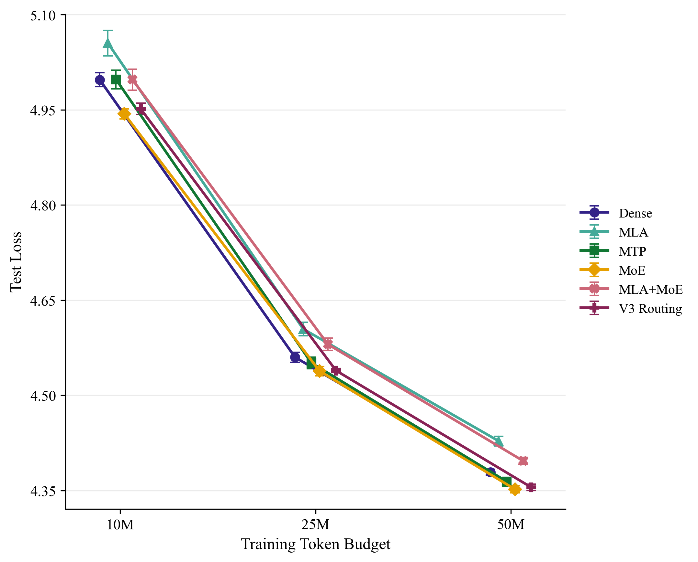
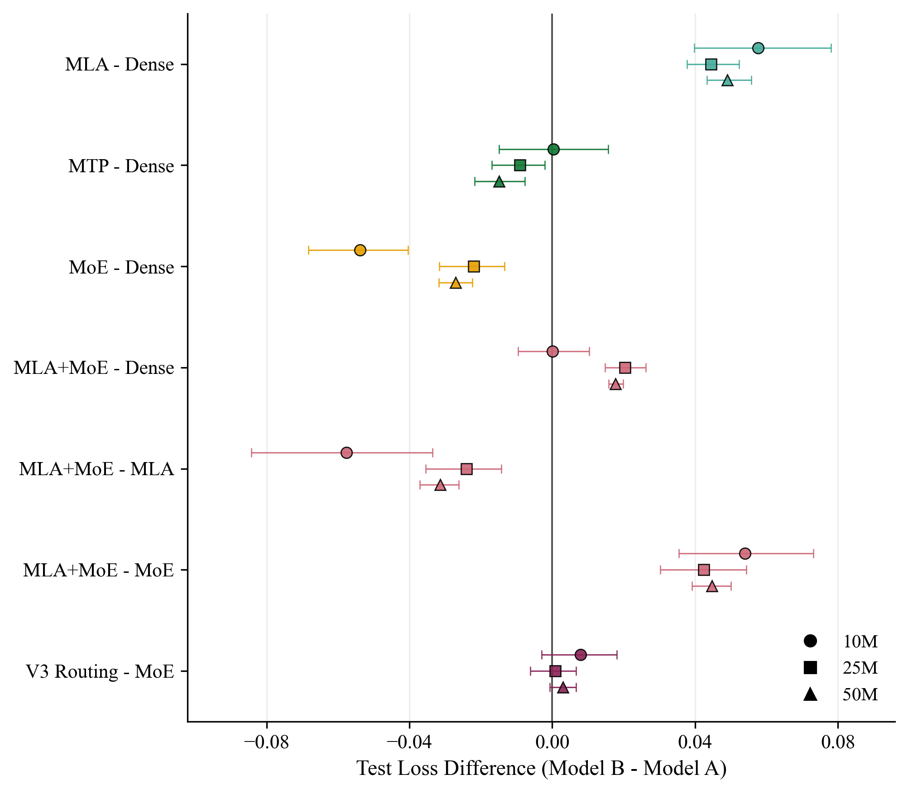
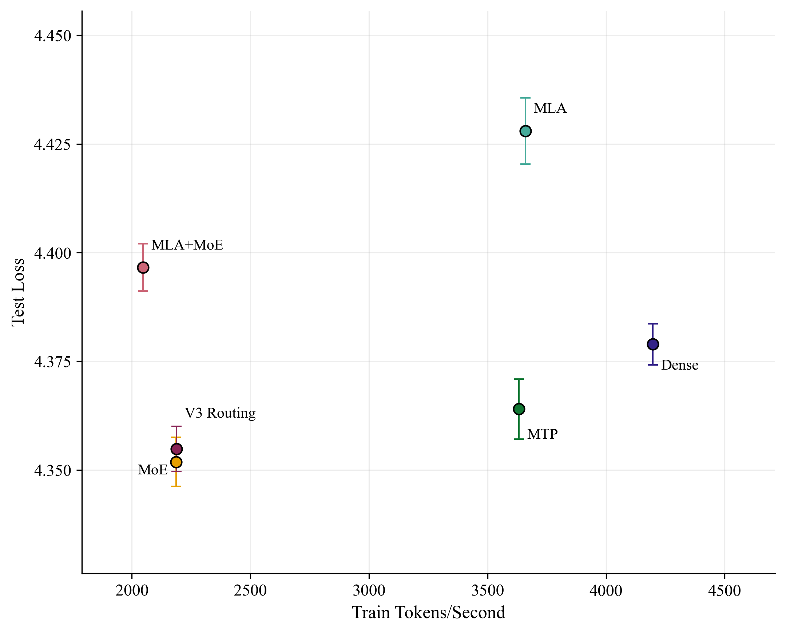
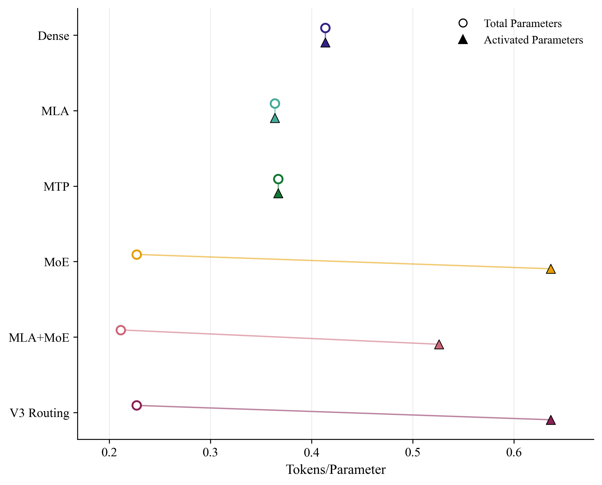

# DeepSeek-Inspired Efficiency Study

A controlled, multi-seed study of Multi-Head Latent Attention, sparse mixture-of-experts routing, V3-style expert-bias load balancing, and multi-token prediction under data-limited local training.

[Read the full report](reports/DS_proj_report.pdf)

## Study

This study evaluates whether DeepSeek-inspired efficiency mechanisms improve predictive quality, parameter exposure, throughput, memory use, routing behavior, or optimization at a scale that can be trained on one local GPU.

The study compares six decoder-only model families:

- Dense
- MLA
- MTP
- MoE
- MLA+MoE
- V3 Routing

| Dimension | Setting |
|---|---|
| Experiment matrix | 6 models × 3 token budgets × 10 aligned seeds |
| Completed runs | 180 |
| Token budgets | 10M, 25M, and 50M |
| Context length | 256 |
| Corpus | FineWeb-Edu sample-10BT |
| Training documents | 50,000 |
| Tokenizer | Byte-level BPE, vocabulary 10,000 |
| Model scale | Approximately 121M–237M total parameters |
| Hardware | NVIDIA GeForce RTX 4050 |
| Precision | FP32 |
| Primary outcome | Test next-token cross-entropy |

Test loss was analyzed using aligned-seed paired contrasts, exact sign-flip tests, 20,000-resample bootstrap intervals, and Holm correction across the 21 planned test-loss comparisons.

## Key findings

- All six models improved as the token budget increased. Mean test loss fell by 0.679–0.810 from 10M to 50M tokens, with every aligned seed improving.
- Dense provided the strongest overall local balance of quality, throughput, memory use, and implementation simplicity.
- The MLA analogue produced higher test loss, lower throughput, and greater allocated memory than Dense at every budget.
- MoE separated stored capacity from activated capacity, activating approximately 35.7% of its parameters per token, but no test-loss advantage over Dense survived the primary correction. Its local execution was also slower and more memory-intensive.
- Combining MLA with MoE did not compound their intended benefits and performed worse than ordinary MoE.
- V3-style routing did not improve next-token quality and ended with higher terminal expert-load variance than the auxiliary-loss MoE baseline.
- MTP reduced its auxiliary future-token loss but did not establish a reliable next-token sample-efficiency gain.

## Key figures

### Test loss across token budgets



### Planned test-loss contrasts



### Quality–throughput tradeoff at 50M tokens



### Total versus activated parameter exposure



Additional report-ready and diagnostic figures are available under `results/figures/`.

## Repository structure

```text
deepseek-reimplementation/
├── configs/
│   ├── data/
│   ├── experiment/
│   ├── model/
│   ├── tokenizer/
│   └── train/
├── deepseek_reimpl/
│   ├── data/
│   ├── eval/
│   ├── instrumentation/
│   ├── layers/
│   ├── model/
│   ├── tokenizer/
│   ├── train/
│   └── utils/
├── scripts/
│   ├── analysis/
│   ├── data/
│   ├── tokenizer/
│   └── train/
├── results/
│   ├── analysis/
│   ├── figures/
│   ├── metrics/
│   └── raw_logs/
├── tests/
├── docs/
├── reports/
├── requirements.txt
├── requirements-dev.txt
└── pyproject.toml
```

## Reproduction

The commands below match the Windows and PowerShell environment. The complete 180-run matrix is computationally expensive.

### 1. Environment setup

```powershell
git clone https://github.com/mmiovski/deepseek-reimplementation.git
cd deepseek-reimplementation

py -3.11 -m venv .venv
.\.venv\Scripts\Activate.ps1

python -m pip install --upgrade pip
python -m pip install -r requirements-dev.txt
```

The environment used Python 3.11.9, PyTorch 2.6.0+cu124, and CUDA 12.4.

### 2. Prepare the corpus and tokenizer

```powershell
python scripts\data\prepare_hf_streaming_text.py `
    --config configs\data\fineweb_edu_10bt.yaml `
    --max-train-examples 50000 `
    --max-validation-examples 1000 `
    --max-test-examples 1000

python scripts\tokenizer\train_tokenizer.py `
    --config configs\tokenizer\bpe_fineweb_edu_10bt_local_experiment.yaml

python scripts\data\tokenize_lm_corpus.py `
    --data-config configs\data\fineweb_edu_10bt.yaml `
    --tokenizer-config configs\tokenizer\bpe_fineweb_edu_10bt_local_experiment.yaml
```

### 3. Run a configured experiment

```powershell
python scripts\train\run_pretrain.py `
    --experiment-config configs\experiment\main_large_10m_00_dense_121m.yaml
```

### 4. Run the complete matrix

Build the canonical manifest and queue:

```powershell
python scripts\analysis\build_balanced_10seed_matrix_manifest.py
```

Run the resumable PowerShell queue:

```powershell
powershell -ExecutionPolicy Bypass `
    -File .\scripts\run_balanced_10seed_matrix_queue.ps1
```

The queue skips experiments whose `summary.json` already exists. After completion, rebuild the manifest to refresh its status fields:

```powershell
python scripts\analysis\build_balanced_10seed_matrix_manifest.py
```

### 5. Rebuild the analysis artifacts

```powershell
$analysisScripts = @(
    "extract_balanced_10seed_matrix_artifacts.py",
    "summarize_balanced_10seed_matrix_descriptives.py",
    "analyze_balanced_10seed_matrix_global_tests.py",
    "analyze_balanced_10seed_matrix_paired_contrasts.py",
    "analyze_balanced_10seed_matrix_budget_trends.py",
    "build_balanced_10seed_mechanism_profiles.py"
)

foreach ($script in $analysisScripts) {
    python ".\scripts\analysis\$script"
}
```

Regenerate all tracked figures:

```powershell
Get-ChildItem .\scripts\analysis\plot_*.py |
    Sort-Object Name |
    ForEach-Object {
        python $_.FullName
    }

python scripts\analysis\build_balanced_10seed_evidence_index.py
```

### 6. Validate the repository

```powershell
python -m pytest
python -m ruff check .
python -m black --check .
python -m mypy deepseek_reimpl

python scripts\analysis\verify_final_data_tokenizer_provenance.py `
    --require-local-artifacts

python scripts\analysis\build_balanced_10seed_evidence_index.py --check
```

The repository state passed 257 tests together with formatting, linting, type, provenance, metric-hash, and figure-hash checks.

## Scope and limitations

This is a controlled local efficiency study, not a full reproduction of the production DeepSeek-V2, DeepSeek-V3, or DeepSeek-R1 systems. It does not include distributed expert parallelism, custom sparse kernels, production KV-cache benchmarking, speculative decoding, instruction tuning, reinforcement learning, or reasoning evaluation.

The retained implementation also contains a documented RoPE frequency-layout mismatch shared across all six model families. The reported results describe the implemented systems; a corrected full rerun remains future work.

## License

This study is released under the [MIT License](LICENSE).
